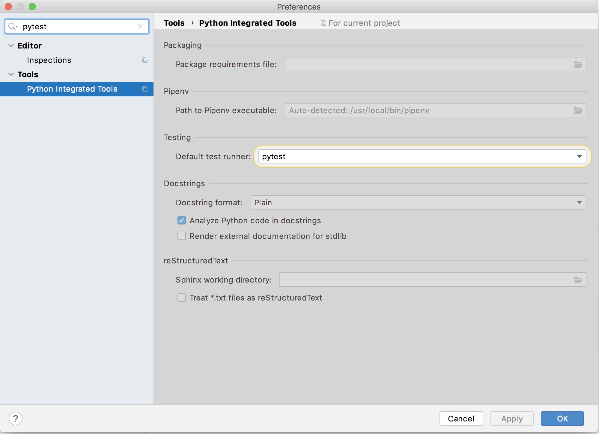

# [Castlabs Programming Task](https://github.com/castlabs/python_programming_task)

## Abstract

This repository tries to cover [the challenge](https://github.com/castlabs/python_programming_task)
as good as possible. Since this is a coding challenge, there are some limitations, some of them are 
marked as `TODO` in the code and maybe even mentioned below. 

## Usage

### Locally

This repository is intented to be used locally for development. 

#### Development Prerequisites

- You need to have UNIX compatible OS
- You need to have `make` and *Python3.8* installed
- Probably you also need a C compiler toolchain (not sure about the dependencies)
- It is assumed you have a Python IDE installed, particulary *PyCharm*
- After checkout, run `make bootstrap dev.build` *before* opening the project in PyCharm. 
  This ensures to let PyCharm find the `venv` and its containing local Python interpreter.
- After opening the project in PyCharm, ensure the projects test-runner is configured to use 
  `pytest`
  
  

#### Development

To build your development environment, use

```bash
make dev.build
```

To run all tests, use

```bash
make test
```

Once you followed the prerequisites section, you will also be able to run and debug single tests 
from PyCharm. 

#### Run Prerequisites

- Docker
- `docker-compose`
   
#### Run

To just run the current version, use 

```bash
docker-compose up --build
```

In an other terminal, you can call 

```bash
http_proxy=127.0.0.1:8000 curl 'httpbin.org/get?a=1'
```

to see the thing in action.
